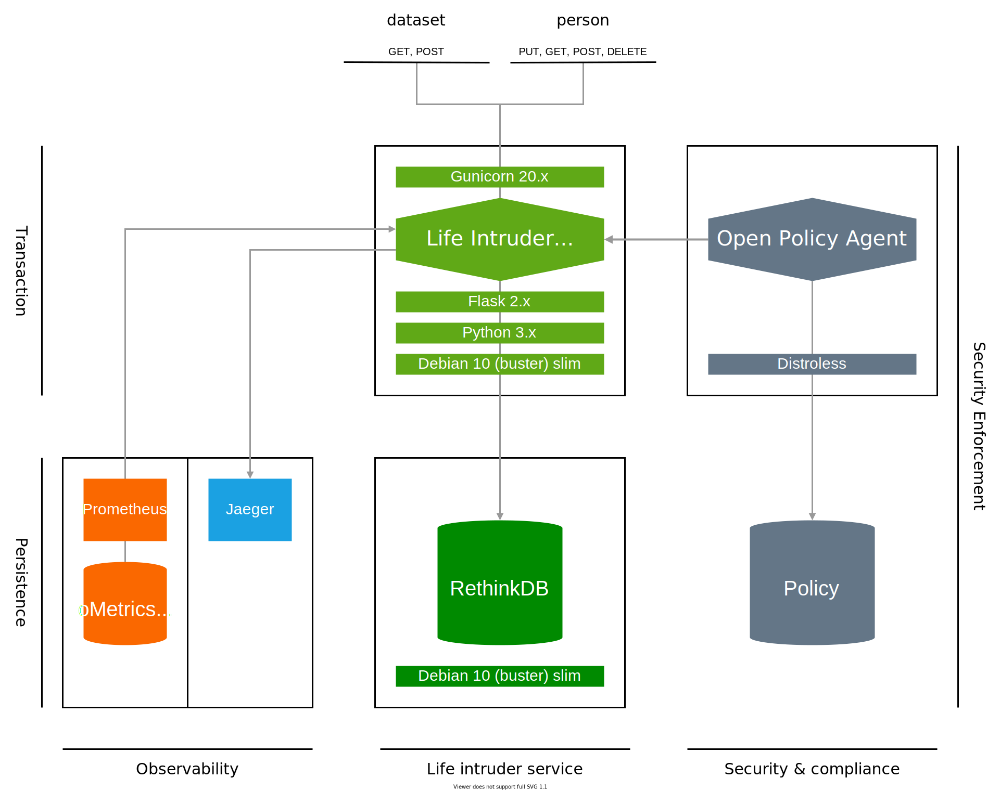

# Life Intruder service

The Life Intruder service exposes a RESTful API endpoins to access an awkward identity database.

## Architecture

The Life Intruder service is a stateful service based on the Flask python micro-framework and a RethinkDB database.

### Instrumentation

The service is intrumented with the following technologies to acheive better observability and security.

Tool | Description | Website
---- | ----------- | -------
Flask Prometheus exporter | An integrated OpenMetrics/Prometheus compliant library to export Flask metrics | <https://pypi.org/project/prometheus-flask-exporter>
OpenTelemetry | An integrated OpenTelemetry compliant libray to export Flask traces | <https://opentelemetry-python.readthedocs.io> 
OpenPolicyAgent | A external policy enforcement agent to sercure the RESTful API calls | <https://openpolicyagent.org>

## RBAC

The service leverage [Open Policy Agent](https://openpolicyagent.org) for the access control to the API resources, following roles are defined

* **Anonymous**: Limited to read the API specifications and metrics
* **Manager**: Authorized to add datasets, and manage any of the persons profiles
* **Operator**: Limited to update persons profiles
* **Reviewer**: Limited to ready all profiles at once
* **Reader** : Limited to read a given person profile at once

Action | Description | Anonymous | Manager | Operator | Reviewer | Reader
------ | ----------- | :-------: | :-----: | :------: | :------: | :----:
`GET /apis/spec` | Read API Specifications | +
`GET /metrics` | Read service metrics _(OpenMetris:Prometheus)_ | +
`GET /apidocs` | Access Swagger API documentation | +
`PUT /apis/dataset/v1` | Import a dataset |  | + |
`GET /apis/dataset/v1` | Export all data |  | + | | + |
`GET /apis/person/v1/<guid:string>`  | Read the profile a given person by its GUID | | + | + | + | +
`PUT /apis/person/v1/<guid:string>` | Add a person's profile | | + |
`POST /apis/person/v1/<guid:string>` | Update a person's profile | | + | +
`DELETE /apis/person/v1/<guid:string>` | Remove a person's profile | | + |

## Data schema

The schema of the database is based on the [Fake Name Generator](https://fakenamegenerator.com) delivry capabilities.
The detailed description of each filed is documented below, and can be retreived either in the Swagger definition file or by accessing the `/apidocs` or `/apis/spec` service endpoints.

Category | Name | Type | Description | Primary Key | Nullable
-------- | ---------- | ---------- | ----------------- | ----------- | --------
Other | `GUID`     | string     | The globally unique identifier of an individual | True | False
Other | `Color` | string | The prefered color of an individual
Other | `Vehicle` | string | The vehicle model date and name of the car owned by an individual | |
Other | `Number` | integer | The number associated to an individual
Other | `NameSet` | string | The language origin of the name associated to an individual | |
Identity | `GivenName` | string | The given name or first name of an individual | | False
Identity | `Surname`  | string | The surname or last name of an individual | | False
Identity | `MothersMaiden` | string | The mother's maiden name of an individual | |
Identity | `MiddleInitial` | string | The first letter of the middle name of an individual
Identity | `Gender` | string | The name sexual gender of an individual | |
Identity | `Title` | string | The title assiciated to an individual | |
Citizenship | `NationalID` | string | The national id assiociated to the identity card of an individual | | |
Residential | `StreetAddress` | string | The street address where an individual resides
Residential | `ZipCode` | integer | The zip code associated to the city where an individual lives
Residential | `City` | The name of the city where an individual resides
Residential | `StateFull` | string | The state name where an individual resides
Residential | `CountryFull` | string | The name of the country where an individual resides
Residential | `Country` | string | The code of the country where an individual resides
Residential | `State` | string | The state code where an individual resides
Geo Coordinates | `Latitude` | float | The latitude where an invidual can be found | |
Geo Coordinates | `Longitude` | float | The longitude where an invidual can be found | |
Phone | `TelephoneCountryCode` | integer | The country code associated to the telephone number of an individual | |
Phone | `TelephoneNumber` | string | The telephone number of an individual | |
Birthday | `Birthday` | string | The birthday date of an individual in the U.S format (i.e. MM/DD/YYYY) | | |
Birthday | `Age` | integer | The age of an individual | | |
Birthday | `TropicalZodiac` | string | The tropical zodiac sign associated to the birth date of an individual | | |
Online | `EmailAddress` | string | The email address owned by an individual | | False
Online | `Username` | string | The account username of an individual | |
Online | `Password` | string | The account password of an individual | |
Online | `Domain`   | string | The domain name of the website owned or associated to an individual | |
Online | `BrowserUserAgent` | string | The user agent of the web browser used by an individual | |
Finance | `CCType` | string | The name of the provider of the credit card owned by an individual | |
Finance | `CCNumber` | integer | The number of the credit card owned by an individual | |
Finance | `CCExpires` | string | The expiration date of the credit card owned by an individual (i.e. MM/YYYY) | |
Finance | `CVV2` | integer | The visual cryptogram assciated with the credit card owned by an individual | |
Employment | `Company` | string | The name of the company an individual is working for | |
Employment | `Occupation` | string | The employment occupation of an individual | |
Physical Characteristics | `Centimeters` | integer | The height estimated in centimeters of an individual | |
Physical Characteristics | `FeetInches` | string | The height estimated in feets of an individual (e.g. `5' 3"`)
Physical Characteristics | `Kilograms` | float | The weight estimated in kilograms of an individual | |
Physical Characteristics | `Pounds` | string | The weight estimated in pounds of an individual | |
Physical Characteristics | `BloodType` | string | The blood type of an individual | |
Tracking Numbers | `UPS` | string | The United Parcel Service tracking number of an individual | |
Tracking Numbers | `WesternUnionMTCN` | integer | The Western Union's money transfer control number of an individual | |
Tracking Numbers | `MoneyGramMTCN` | integer | The Money Gram's money transfer control number of an individual | |
